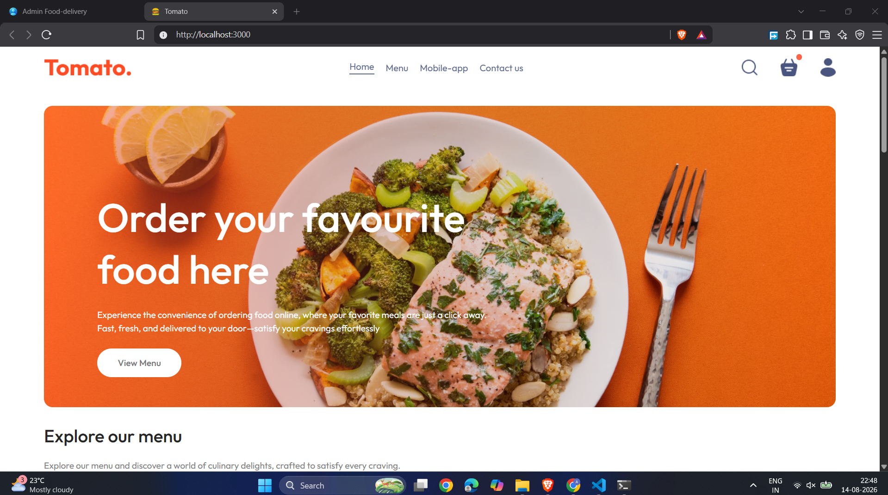
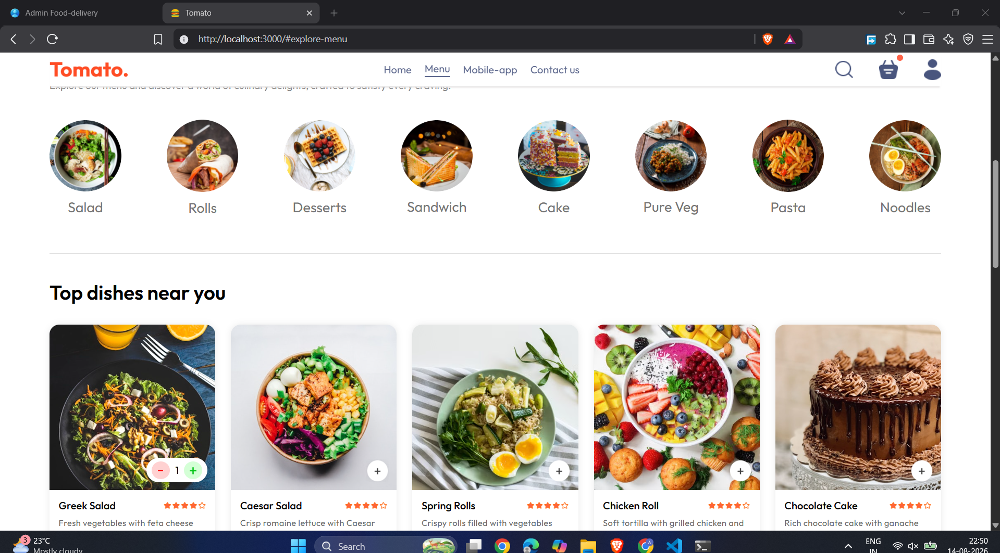
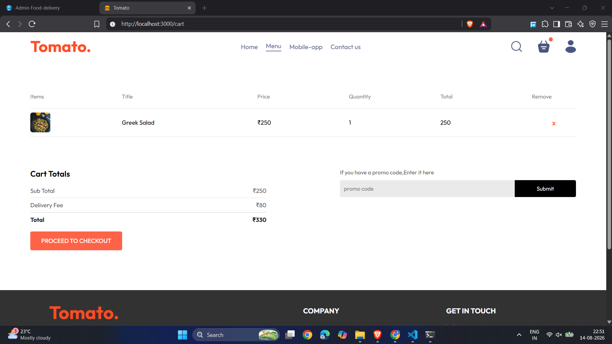
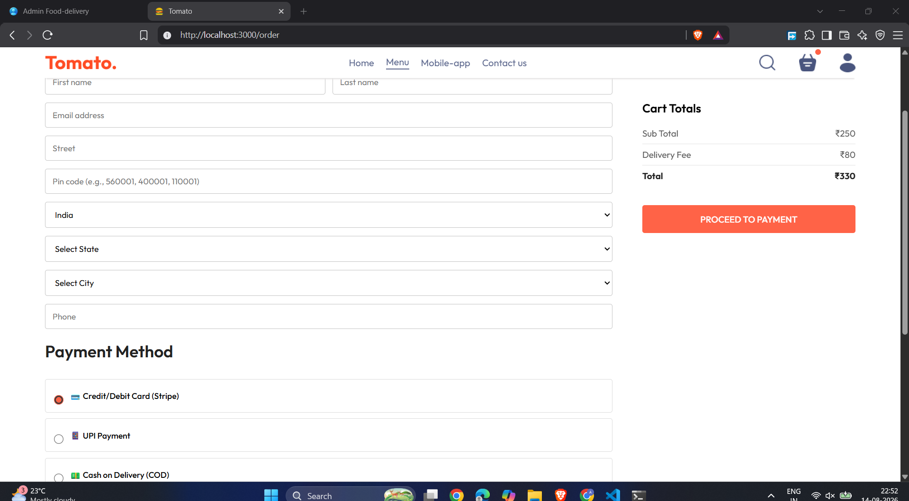
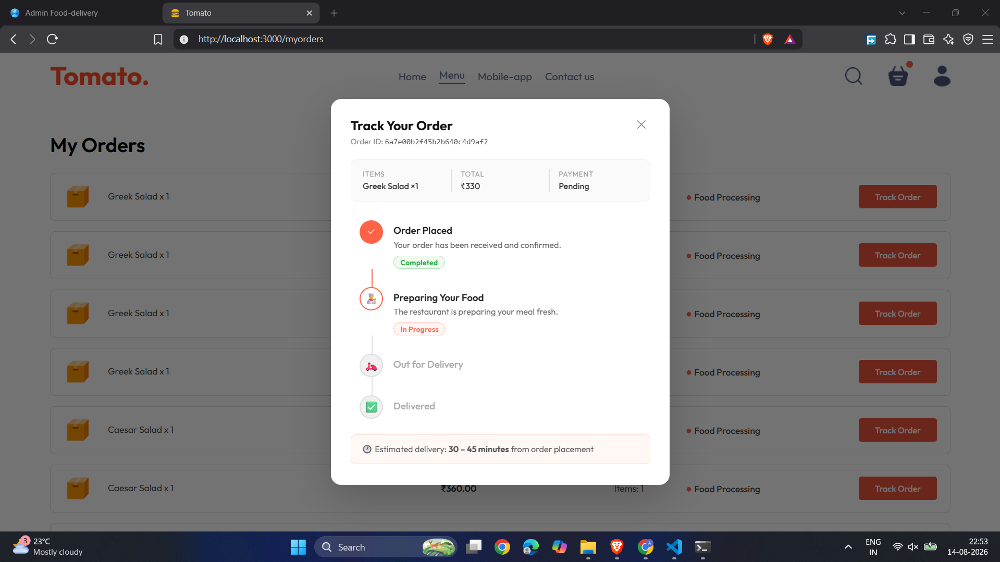
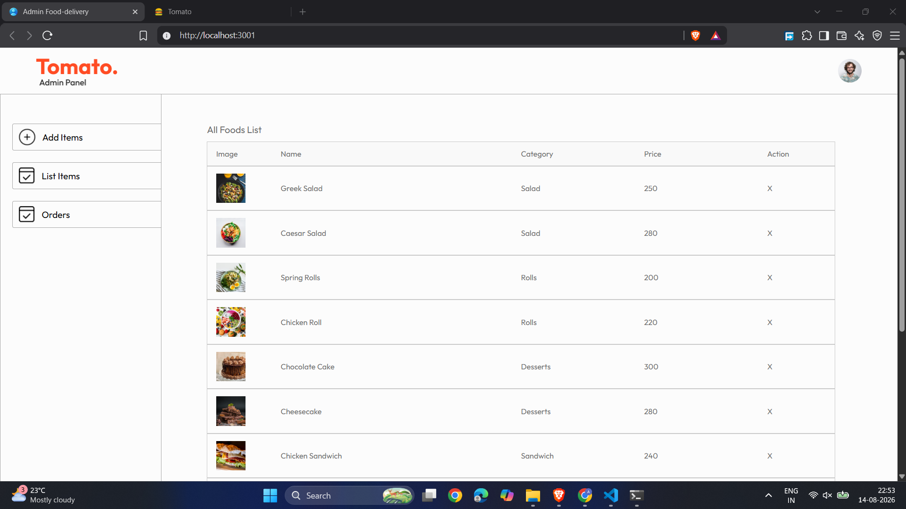

# 🍅 Tomato — Food Delivery App

A full-stack food delivery web application built with **React**, **Node.js / Express**, and **MongoDB Atlas**. Customers can browse dishes, manage a cart, place orders (Stripe / UPI / COD), and track delivery status in real time. A separate React admin panel lets restaurant owners manage food items and orders.

---

## 📸 Screenshots

> Add your own screenshots by replacing the placeholder paths below.  
> Tip: take screenshots with browser DevTools open at 1280 × 800 (desktop) and 375 × 812 (iPhone 14).

| Home Page | Food Menu | Cart |
|:---------:|:---------:|:----:|
|  |  |  |

| Place Order | My Orders / Track | Admin Panel |
|:-----------:|:-----------------:|:-----------:|
|  |  |  |

---

## 🗂️ Project Structure

```
food-delivery-app/
├── backend/                  # Express REST API
│   ├── config/
│   │   └── db.js             # MongoDB Atlas connection
│   ├── controllers/
│   │   ├── cartController.js
│   │   ├── foodControllers.js
│   │   ├── orderController.js
│   │   └── userController.js
│   ├── middleware/
│   │   ├── auth.js           # JWT verification
│   │   └── errorHandler.js
│   ├── model/
│   │   ├── foodModel.js
│   │   ├── orderModel.js
│   │   └── userModel.js
│   ├── routes/
│   │   ├── cartRoute.js
│   │   ├── foodRoute.js
│   │   ├── orderRoute.js
│   │   └── userRoute.js
│   ├── uploads/              # Multer image uploads
│   ├── seedFoods.js          # Seed script (run once)
│   ├── server.js             # App entry point
│   └── .env.example
│
├── frontend/                 # Customer-facing React app
│   ├── public/
│   │   └── index.html        # Tab title: Tomato
│   ├── src/
│   │   ├── assets/           # Icons, logos, images
│   │   ├── components/
│   │   │   ├── AppDownload/  # App store badges
│   │   │   ├── ExploreMenu/  # Category filter
│   │   │   ├── FoodDisplay/  # Food card grid
│   │   │   ├── Footer/       # Footer with social links
│   │   │   ├── Header/       # Hero banner
│   │   │   ├── LoginPopup/   # Auth modal
│   │   │   └── navbar/       # Responsive navbar + hamburger
│   │   ├── context/
│   │   │   └── StoreContext.jsx  # Global state (cart, auth, food)
│   │   ├── pages/
│   │   │   ├── AboutUs/      # About page
│   │   │   ├── Cart/         # Cart page
│   │   │   ├── Home/         # Home (Header+Menu+FoodDisplay)
│   │   │   ├── MyOrders/     # Order history + Track modal
│   │   │   ├── PlaceOrder/   # Checkout + payment selection
│   │   │   ├── PrivacyPolicy/# T&C page
│   │   │   └── Verify/       # Stripe payment verify
│   │   └── App.jsx           # Router
│   └── .env.example
│
├── admin/                    # Admin React app
│   ├── src/
│   │   ├── components/
│   │   │   ├── navbar/
│   │   │   └── sidebar/
│   │   └── pages/
│   │       ├── Add/          # Add new food item
│   │       ├── List/         # View / delete food items
│   │       └── Orders/       # View & update order status
│   └── .env.example
│
├── run-project.bat           # One-click launcher (Windows)
└── README.md
```

---

## 🔄 Architecture & Data Flow

```
┌─────────────────────────────────────────────────────────────────┐
│                        BROWSER CLIENTS                          │
│                                                                 │
│   ┌───────────────────┐         ┌───────────────────┐          │
│   │   Customer App    │         │    Admin Panel    │          │
│   │  localhost:3000   │         │  localhost:3001   │          │
│   │  (React + Router) │         │  (React + Router) │          │
│   └────────┬──────────┘         └─────────┬─────────┘          │
└────────────│─────────────────────────────│────────────────────-┘
             │  HTTP / Axios                │  HTTP / Axios
             ▼                             ▼
┌─────────────────────────────────────────────────────────────────┐
│                     BACKEND  (Express.js)                       │
│                       localhost:4000                            │
│                                                                 │
│  ┌──────────┐  ┌──────────┐  ┌──────────┐  ┌──────────────┐   │
│  │ /api/user│  │/api/food │  │/api/cart │  │ /api/order   │   │
│  │  login   │  │  list    │  │  add     │  │  place       │   │
│  │  register│  │  add     │  │  remove  │  │  userorders  │   │
│  │          │  │  remove  │  │  get     │  │  allorders   │   │
│  └────┬─────┘  └────┬─────┘  └────┬─────┘  └──────┬───────┘   │
│       │              │              │               │           │
│  JWT Middleware  Multer (images)   JWT            Stripe API    │
│       └──────────────┴──────────────┴───────────────┘          │
│                              │                                  │
└──────────────────────────────│──────────────────────────────────┘
                               │  Mongoose ODM
                               ▼
┌─────────────────────────────────────────────────────────────────┐
│                     MongoDB Atlas (Cloud)                       │
│                                                                 │
│   Collections:  users │ foods │ orders                         │
└─────────────────────────────────────────────────────────────────┘
```

---

## 🛒 Customer Journey Flow

```
Visit Site
    │
    ▼
Browse Home Page
    │  Category filter (Salad, Rolls, Sandwich …)
    ▼
Food Display Grid ──► Add to Cart (+ / - buttons)
    │
    ▼
Cart Page
    │  Review items, see sub-total + ₹80 delivery fee
    ▼
Checkout (Login required)
    │
    ├─► Sign In / Register (JWT issued, stored in localStorage)
    │
    ▼
Place Order Page
    │  Fill delivery address
    │  Choose payment:
    │    ├─ Stripe (card) ──► Stripe hosted page ──► /verify
    │    ├─ UPI            ──► [redirect to UPI flow]
    │    └─ COD            ──► Order confirmed immediately
    ▼
My Orders Page
    │  See all past orders
    └─► Track Order button
            │
            ▼
        Timeline Modal
        ┌──────────────────────────────┐
        │ ✅ Order Placed              │
        │ 👨‍🍳 Preparing Your Food  ◄──── status updated by admin
        │ 🛵 Out for Delivery          │
        │ ✅ Delivered                 │
        └──────────────────────────────┘
```

---

## ⚙️ Admin Flow

```
Admin Login (Firebase Auth)
    │
    ▼
Sidebar Navigation
    │
    ├─► Add Food Item
    │       │  Upload image + fill name/price/category
    │       └─► POST /api/food/add  ──► Saved to MongoDB
    │
    ├─► List Food Items
    │       │  View all foods in grid
    │       └─► DELETE /api/food/remove  ──► Removed from DB
    │
    └─► Orders
            │  View all customer orders
            └─► Update Status dropdown
                  (Order Placed → Food Processing
                   → Out for Delivery → Delivered)
                  PUT /api/order/status  ──► DB updated
                  Customer sees update on Track Order modal
```

---

## 🛠️ Tech Stack

| Layer | Technology |
|-------|-----------|
| Frontend | React 18, React Router v6, Axios, CSS3 |
| Admin | React 18, React Router v6, Axios, React Toastify |
| Backend | Node.js, Express.js, Multer (file uploads) |
| Database | MongoDB Atlas, Mongoose ODM |
| Auth | JWT (jsonwebtoken) + bcrypt |
| Payments | Stripe Checkout Sessions |
| Deployment | Vercel (frontend/admin) + Render (backend) |

---

## 🚀 Quick Start (Local)

### Prerequisites
- [Node.js](https://nodejs.org) v18+
- A [MongoDB Atlas](https://cloud.mongodb.com) free cluster
- A [Stripe](https://stripe.com) account (free test keys)

### 1 — Clone the repo
```bash
git clone https://github.com/Abhijeet-035/food-delivery-app.git
cd food-delivery-app
```

### 2 — Set up environment variables
```bash
# Backend
copy backend\.env.example backend\.env
# Edit backend\.env and fill in:
#   MONGO_URI   = your MongoDB Atlas connection string
#   JWT_SECRET  = any long random string
#   STRIPE_SECRET_KEY = sk_test_...
```

Frontend and admin `.env` files are auto-created by the launcher with the default `http://localhost:4000`.

### 3 — Launch everything (Windows)
Double-click **`run-project.bat`**

This will:
1. Check Node.js is installed
2. Auto-copy `.env` files if missing
3. Install `node_modules` in all three folders if needed
4. Open three colour-coded terminal windows (Backend / Frontend / Admin)
5. Wait 30 seconds for compilation, then open browser tabs automatically

### 4 — Seed the database (first time only)
```bash
cd backend
node seedFoods.js
```
This populates the database with 16 sample food items across all categories.

### 5 — Access the apps
| App | URL |
|-----|-----|
| Customer site | http://localhost:3000 |
| Admin panel | http://localhost:3001 |
| Backend API | http://localhost:4000 |

---

## 🌐 Deployment Guide (Free — Step by Step)

The recommended free stack is:
- **MongoDB Atlas** — free M0 cluster (database)
- **Render** — free tier (backend)
- **Vercel** — free hobby plan × 2 (frontend + admin)

---

### Step 1 — Push to GitHub

```bash
git add .
git commit -m "Initial commit"
git remote add origin https://github.com/YOUR_USERNAME/food-delivery-app.git
git push -u origin main
```

> ⚠️ Make sure `.env` files are in `.gitignore` — never commit secrets.

---

### Step 2 — Deploy Backend on Render

1. Go to [render.com](https://render.com) → **New → Web Service**
2. Connect your GitHub account and select your repo
3. Configure:
   - **Name:** `tomato-backend`
   - **Root Directory:** `backend`
   - **Runtime:** `Node`
   - **Build Command:** `npm install`
   - **Start Command:** `node server.js`
4. Under **Environment Variables**, add:
   ```
   MONGO_URI          = mongodb+srv://...
   JWT_SECRET         = your_secret
   STRIPE_SECRET_KEY  = sk_live_... or sk_test_...
   PORT               = 4000
   ```
5. Click **Create Web Service** — Render gives you a URL like:
   ```
   https://tomato-backend.onrender.com
   ```
6. Copy this URL — you'll need it for frontend/admin.

> 💡 Free Render instances sleep after 15 minutes of inactivity and take ~30 s to wake up on the first request. This is normal on the free plan.

---

### Step 3 — Deploy Frontend on Vercel

1. Go to [vercel.com](https://vercel.com) → **Add New → Project**
2. Import your GitHub repo
3. Configure:
   - **Framework Preset:** `Create React App`
   - **Root Directory:** `frontend`
4. Under **Environment Variables**, add:
   ```
   REACT_APP_API_URL = https://tomato-backend.onrender.com
   ```
5. Click **Deploy** → you get a URL like:
   ```
   https://tomato-frontend.vercel.app
   ```

---

### Step 4 — Deploy Admin on Vercel

1. Go to [vercel.com](https://vercel.com) → **Add New → Project**
2. Import the **same** GitHub repo again
3. Configure:
   - **Framework Preset:** `Create React App`
   - **Root Directory:** `admin`
4. Under **Environment Variables**, add:
   ```
   REACT_APP_API_URL = https://tomato-backend.onrender.com
   ```
5. Click **Deploy** → you get a URL like:
   ```
   https://tomato-admin.vercel.app
   ```

---

### Step 5 — Update CORS on Backend

After deploying, update your `backend/server.js` CORS origin (or add an env var):

```js
app.use(cors({
  origin: [
    "https://tomato-frontend.vercel.app",
    "https://tomato-admin.vercel.app"
  ],
  credentials: true,
}));
```

Redeploy backend on Render after this change.

---

### Step 6 — MongoDB Atlas — Allow All IPs

In MongoDB Atlas → **Network Access** → Add IP Address → `0.0.0.0/0` (allow from anywhere).  
This is required because Render uses dynamic IPs on the free tier.

---

### Step 7 — Re-seed Production Database

After backend is live, run the seed once against production:
```bash
cd backend
# Temporarily set your prod MONGO_URI in .env, then:
node seedFoods.js
# Restore local .env afterwards
```

---

### ✅ Deployment Checklist

```
[ ] MongoDB Atlas cluster created (M0 free)
[ ] Atlas network access: 0.0.0.0/0 allowed
[ ] Backend deployed on Render with all env vars set
[ ] Frontend deployed on Vercel with REACT_APP_API_URL set
[ ] Admin deployed on Vercel with REACT_APP_API_URL set
[ ] CORS updated to allow Vercel domains
[ ] Database seeded via seedFoods.js
[ ] Test: register user, add to cart, place COD order, track order
[ ] Test: admin login, update order status, verify customer sees update
```

---

## 📡 API Reference

### Auth — `/api/user`
| Method | Endpoint | Description |
|--------|----------|-------------|
| POST | `/api/user/register` | Register new user |
| POST | `/api/user/login` | Login, returns JWT |

### Food — `/api/food`
| Method | Endpoint | Description |
|--------|----------|-------------|
| GET | `/api/food/list` | Paginated food list |
| GET | `/api/food/allfoods` | All foods (for filtering) |
| POST | `/api/food/add` | Add food item (admin) |
| DELETE | `/api/food/remove` | Remove food item (admin) |

### Cart — `/api/cart` *(JWT required)*
| Method | Endpoint | Description |
|--------|----------|-------------|
| POST | `/api/cart/add` | Add item to cart |
| POST | `/api/cart/remove` | Remove item from cart |
| POST | `/api/cart/get` | Get user's cart |

### Orders — `/api/order` *(JWT required)*
| Method | Endpoint | Description |
|--------|----------|-------------|
| POST | `/api/order/place` | Place order (Stripe/COD) |
| POST | `/api/order/verify` | Verify Stripe payment |
| POST | `/api/order/userorders` | Get user's orders |
| GET | `/api/order/list` | All orders (admin) |
| POST | `/api/order/status` | Update order status (admin) |

---

## 🔐 Environment Variables

### `backend/.env`
```env
MONGO_URI=mongodb+srv://<user>:<pass>@<cluster>.mongodb.net/food_delivery
JWT_SECRET=your_super_secret_key_here
STRIPE_SECRET_KEY=<your_stripe_secret_key>
PORT=4000
```

### `frontend/.env` and `admin/.env`
```env
REACT_APP_API_URL=http://localhost:4000
```

---

## 📱 Responsive Design

The app is fully responsive across all screen sizes:

| Breakpoint | Target |
|-----------|--------|
| ≥ 1050px | Desktop |
| 750px – 1050px | Tablet |
| 480px – 750px | Large phone |
| ≤ 480px | Small phone |
| ≤ 360px | Very small phone |

Key responsive features:
- Navbar collapses to a hamburger menu on mobile
- Food card grid adapts from 4 columns → 2 columns → 1 column
- Place Order form stacks vertically on mobile
- Order table simplifies columns on small screens
- Track Order modal is fully usable on any screen size

---

## ✨ Features

- 🔐 User registration & login (JWT auth)
- 🍽️ Browse 8 food categories with live filtering
- 🛒 Add / remove items from cart with quantity controls
- 💳 Multiple payment options: Stripe, UPI, Cash on Delivery
- 📦 Real-time order tracking with Flipkart-style timeline
- 📱 Fully responsive (mobile, tablet, desktop)
- 🔴 Admin panel: add/remove food items, update order status
- 🌐 Social links: GitHub, Twitter/X, LinkedIn
- 📄 About Us, Privacy Policy & Terms pages
- 🏷️ One-click Windows launcher (`run-project.bat`)

---

## 👤 Author

**Abhijeet Kumar**

- GitHub: [@Abhijeet-035](https://github.com/Abhijeet-035)
- Twitter: [@Abhijeet18k](https://x.com/Abhijeet18k)
- LinkedIn: [abhijeet-kumar35](https://www.linkedin.com/in/abhijeet-kumar35/)

---

## 📄 License

This project is open source and available under the [MIT License](LICENSE).
